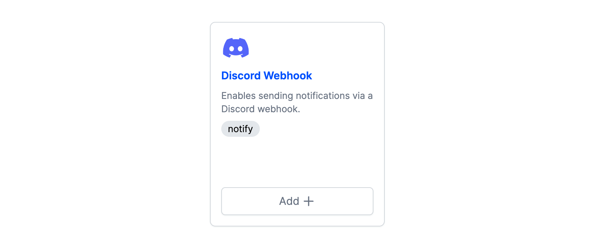

# prefect-discord

<p align="center">
    <!--<a href="https://pypi.python.org/pypi/prefect-discord/" alt="PyPI version">
        </a>-->
    <a href="https://github.com/rpeden/prefect-discord/" alt="Stars">
        </a>
    <a href="https://pepy.tech/badge/prefect-discord/" alt="Downloads">
        </a>
    <a href="https://github.com/rpeden/prefect-discord/pulse" alt="Activity">
        </a>
    <br>
    <a href="https://prefect-community.slack.com" alt="Slack">
        </a>
    <a href="https://discourse.prefect.io/" alt="Discourse">
        </a>
</p>

## Welcome!

A collection containing a notification block making it easy to send messages and notifications from Prefect to a Discord channel. Read on for instructions on how to use the `DiscordWebhook` block.

## Getting Started

### Python setup

Requires an installation of Python 3.7+.

We recommend using a Python virtual environment manager such as pipenv, conda or virtualenv.

These tasks are designed to work with Prefect 2. For more information about how to use Prefect, please refer to the [Prefect documentation](https://orion-docs.prefect.io/).

## Installation

Install `prefect-discord` with `pip`:

```bash
pip install git+https://github.com/rpeden/prefect-discord.git
```

Then, register to [view the block](https://orion-docs.prefect.io/ui/blocks/) on Prefect Cloud:

```bash
prefect block register -m prefect_discord
```

Note, to use the `load` method on Blocks, you must already have a block document [saved through code](https://orion-docs.prefect.io/concepts/blocks/#saving-blocks) or [saved through the UI](https://orion-docs.prefect.io/ui/blocks/).

## Creating a Discord Webhook Block
Before you start, you'll need to add a webhook to one of your Discord channels by following [these instructions](https://support.discord.com/hc/en-us/articles/228383668-Intro-to-Webhooks). When you're done, copy the webhook URL. 

### Via the UI
Click on the **Blocks** menu, then click the **+** button in the page header to open the block catalog:


Find the listing for the Discord Webhook block and click **Add**:


Add a name for your block, paste the Discord webhook URL you copied, and click **Create**:


You'll see your new block's page:


And your block is ready to use!

### In Python
```python
from prefect_discord import DiscordWebhook

my_webhook = DiscordWebhook(
    url="https://my-discord-webhook-url"
)

my_webhook.save("awesome-discord-webhook")

```
## Use Discord Webhook Notifications

```python
from prefect import flow
from prefect_discord import DiscordWebhook


@flow
def example_flow():
    discord_webhook_block = DiscordWebhook.load("awesome-discord-webhook")
    discord_webhook_block.notify("Hello from Prefect!")

example_flow()
```
When you run this code, you should see this in your Discord channel:

  
## Resources

If you encounter any bugs while using `prefect-discord`, feel free to open an issue in the [prefect-discord](https://github.com/rpeden/prefect-discord) repository.

If you have any questions or issues while using `prefect-discord`, you can find help in either the [Prefect Discourse forum](https://discourse.prefect.io/) or the [Prefect Slack community](https://prefect.io/slack).

Feel free to ⭐️ or watch [`prefect-discord`](https://github.com/rpeden/prefect-discord) for updates too!

## Development

If you'd like to install a version of `prefect-discord` for development, clone the repository and perform an editable install with `pip`:

```bash
git clone https://github.com/rpeden/prefect-discord.git

cd prefect-discord/

pip install -e ".[dev]"

# Install linting pre-commit hooks
pre-commit install
```
